# 2015-2019-Presidential-Election-Analysis-with-SQL
>*A Case Study on APC & PDP party in Nigeria*

## Introduction:

This is a presidential election analysis report that occured in Nigeria between the year 2015 & 2019. In this report, we would be focusing on the top or major parties (APC & PDP) involved in the election and a breakdown of how they got their respective votes across the states and geopolitical zones in the country.
 
 
In this project, would be covering the following;
 
 
* Objectives      [here](https://github.com/Ay43/2015-2019-Nigeria-Presidential-Election/blob/main/README.md#objectives)
* Data Sourcing   [here](https://github.com/Ay43/2015-2019-Nigeria-Presidential-Election/blob/main/README.md#data-sourcing)
* Data Loading And Arrangement    [here](https://github.com/Ay43/2015-2019-Nigeria-Presidential-Election/blob/main/README.md#data-loading-and-arrangement)
* Findings    [here](https://github.com/Ay43/2015-2019-Nigeria-Presidential-Election/blob/main/README.md#findings)
* Conclusion    [here](https://github.com/Ay43/2015-2019-Nigeria-Presidential-Election/blob/main/README.md#conclusions)
* Recommended Solutions   [here](https://github.com/Ay43/2015-2019-Nigeria-Presidential-Election/blob/main/README.md#recommended-solutions)
* Codes   [here](https://github.com/Ay43/2015-2019-Nigeria-Presidential-Election/blob/main/README.md#codes)
* Tools   [here](https://github.com/Ay43/2015-2019-Nigeria-Presidential-Election/blob/main/README.md#tools)
* Credits [here](https://github.com/Ay43/2015-2019-Nigeria-Presidential-Election/blob/main/README.md#credits)
 

## Objectives:

The Objective of this analysis is to help answer some questions mentioned in the **findings** section of this project, which is to help give insight or  overview on how APC and PDP were able to gathered votes across all states and geopolitical zones at the 2015 and 2019 Presidential Election in Nigeria. 

Also, the Findings from this report would provide us with a data driven prediction on what is expected to play out in the 2023 presidential election in the country.

You can skip all other process and jump right in to the **Findings** by clicking  [here](https://github.com/Ay43/2015-2019-Nigeria-Presidential-Election/blob/main/README.md#findings) 
 
 
 
## Data Sourcing:

Data was provided in the raw form and can be found [here](https://www.kaggle.com/datasets/somtoe/nigerian-presidential-election-results?select=2023elections.csv)
 
 
 
## Data Loading And Arrangement:

* The table structure was created before the raw file could be loaded into the database with the below command

>*2015 & 2019 Presidential Election Command*

|        2015     |     2019      |
|:----------------|:--------------:|
   |

* The data was loaded into the database from Server/PostgresSQL14/Databases/postgres/Schemas/Public/Tables/ then the 2 tables created namely election_2015 and election_2019.

* From each of the tables created right-click/Import/filename/locate the file/click the format option/select csv/ go to columns and uncheck other colums that are not present in the file/ then OK. At this point our file has been loaded to the database and it is ready for queries 🙂. However, lets have a look on the table information of the two(2) tables namely election_2015 & elections_2019
 
 
>*Table Information*

The 2 tables (election_2015 and election_2019) consist of Eleven(11) columns each

| election_2015     | election_2019      |
|:----------------  |:--------------:|
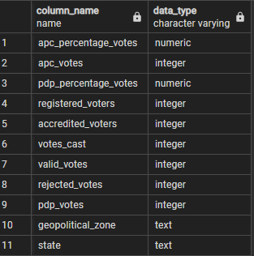   |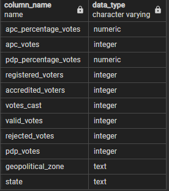

The table structure has been created, data  has been loaded, we have an idea of each table informations so *lets dive into the findings*
  
 
 
## Findings:
 
>*How many states and geopolitical_zones contributed to the 2015 and 2019 presidential election?*

In Nigeria, there are **36 states** and **1 Federal Capital Territory** present in the country making the sum total equals **37 states** available on the dataset and 6 geopolitical_zones in the country.

| Command Prompt    | Result     |
|:----------------  |:--------------:|
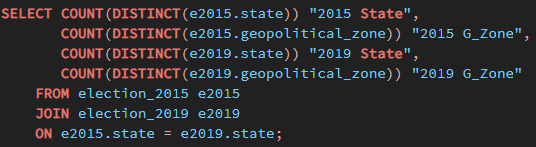   |

Let us have a look at how APC & PDP were able to gather votes across the states and geopolitical zones in the country.

 &nbsp; 
>*What is the AVERAGE votes the 2 parties (Apc & Pdp) got in 2015 & 2019*

It was discovered that APC **(2015: *416890*, 2019: *410590*)** average votes were more than PDP **(2015: *347383*, 2019: *304405*)** average votes in 2015 & 2019 respectively. However, APC votes **fell** 🔽 by 6300 votes in 2019 compare to their average votes in 2015 while PDP votes also **fell** 🔽 by 42978 votes in 2019 compare to their average votes in 2015.

| Command Prompt    | Result     |
|:----------------  |:--------------:|
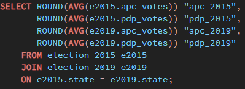   |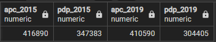

Let us have a look at how the 2 parties were individually affected by the average votes.

 &nbsp;

>*How many APC votes by states were above APC average **(2015: *416890*, 2019: *410590*)** votes got in 2015 & 2019?*

It appears that APC had **13** states out of the 37 cumulative number of states (includung the federal capital territory) votes that were above the AVERAGE votes they got in 2015 and 2019.

| Command Prompt    | Result     |
|:----------------  |:--------------:|
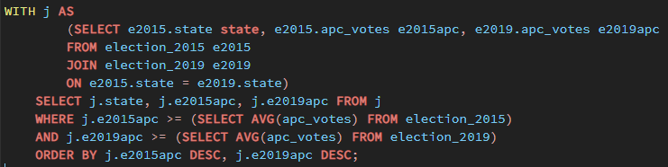   |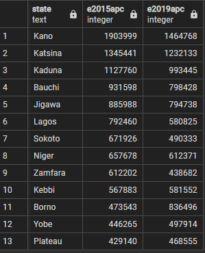

 
 &nbsp; 

>*How many PDP votes by states were above PDP average **(2015: *347383*, 2019: *304405*)** votes got in 2015 & 2019?*

It also appears that PDP had **9** states out of the 37 cumulative number of states (includung the federal capital territory) votes that were above the AVERAGE votes they got in 2015 and 2019.

| Command Prompt    | Result     |
|:----------------  |:--------------:|
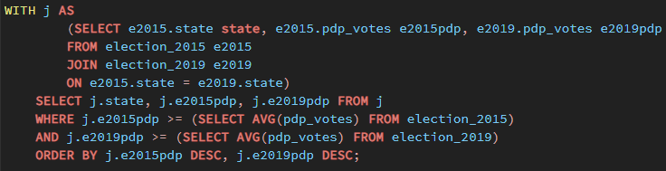   |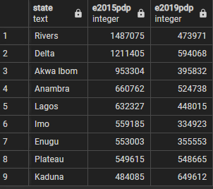

Let us do a COMPARISON between the 2 parties, we would be looking at how many votes by states did one party had above the average votes gotten by the other party in 2015 and 2019.

 &nbsp; 

>*How many APC votes by states were ABOVE PDP average **(2015: *347383*, 2019: *304405*)** votes got in 2015 & 2019?*

It was discovered that APC had **18** states out of the 37 cumulative number of states (includung the federal capital territory) votes that were ABOVE the PDP AVERAGE votes got in 2015 and 2019.

| Command Prompt        | Result     |
|:----------------      |:--------------:|
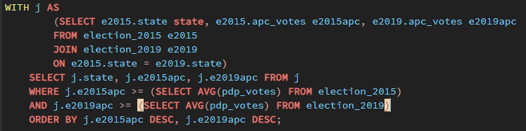 |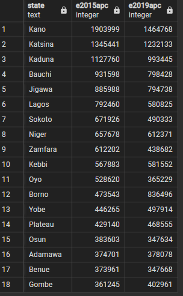

 
 &nbsp; 

>*How many PDP votes by states were above APC average **(2015: *416890*, 2019: *410590*)** votes got in 2015 & 2019?*

It was also discovered that PDP had **6** states out of the 37 cumulative number of states (includung the federal capital territory) votes that were ABOVE the APC AVERAGE votes got in 2015 and 2019.

| Command Prompt        | Result     |
|:----------------      |:--------------:|
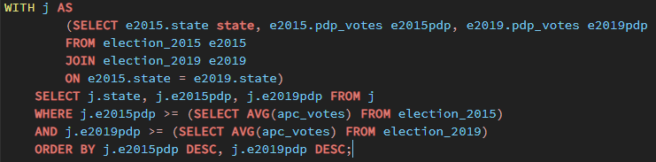 |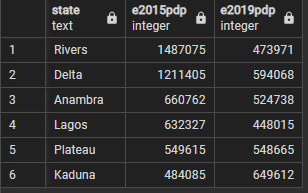

At this point, we already have an understanding how the 2 parties were affected by the average votes got individually and in comparison in 2015 and 2019. *Lets take it further to see the highest vote they got in 2015 & 2019 and how they were affected by it individually and in comparison*.

 &nbsp; 
 
>*What is the HIGHEST votes the 2 parties (Apc & Pdp) got in 2015 & 2019*

In 2015, the HIGHEST votes gotten by the 2 parties (apc & pdp) were 1,903,999 & 1,487,075 respectively while 2019 HIGHEST votes were 1,464,768 & 649,612 respectively. 

However, APC votes **fell** 🔽 by 439,231 in 2019 compare to their highest votes in 2015 while PDP votes also **fell** 🔽 by 837,463 votes in 2019 compare to their highest votes in 2015.

| Command Prompt    | Result     |
|:----------------  |:--------------:|
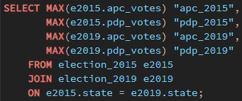   |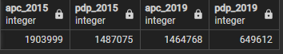

Let us have a look at a comparison of how many states were WON by APC that were ABOVE pdp Highest votes in 2015 & 2019.

&nbsp; 
 
>*How many states were WON by APC above PDP **(2015: *1487075* , 2019: *649612*)** HIGHEST votes in 2015 and 2019*

In 2015

## Conclusions:

>*Overall Findings shows that;*

 
## Recommended Solutions

>*For ;*

## Codes

[Click here]([https://drive.google.com/file/d/1Ta9c0XaGWdDUMatOMZsyPz4cMAKqDLS-/view?usp=sharing](https://github.com/Ay43/2015-2019-Nigeria-Presidential-Election/blob/main/presidential%20election%20(2015%20%26%202019).sql))

## Tools

* Postgresql

## Credits

* @Somtoe
* Kaggle 
* Google
* Github

## Contacts and other Projects

[Click here](https://ay43.github.io/)
