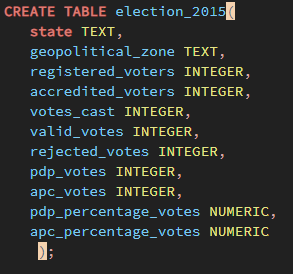
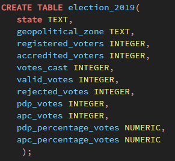

# 2015-2019-Presidential-Election-Analysis-with-SQL
>*A Presidential Election Analysis Report in Nigeria between the year 2015 and 2019*

## Introduction:

This is a presidential election analysis report that occured in Nigeria between the year 2015 & 2019. In this report, we would be focusing on the top or major parties (APC & PDP) involved in the election and a breakdown of how they got their respective votes across the states and geopolitical zones in the country.

## Objectives:

The Objective of this analysis is to help answer some questions mentioned in the **findings** section of this project, which is to help give insight or  overview on how APC and PDP were able to gathered votes across all states and geopolitical zones at the 2015 and 2019 Presidential Election in Nigeria. 

Also, the Findings from this report would provide us with a data driven prediction on what is expected to play out in the 2023 presidential election in the country.

## Data Sourcing:

Data was provided in the raw form and can be found [here](https://www.kaggle.com/datasets/somtoe/nigerian-presidential-election-results?select=2023elections.csv)

## Data Loading And Arrangement:

* The table structure was created before the raw file could be loaded into the database with the below command
>*2015 & 2019 Presidential Election Command*

|        2015     |     2019      |
|:----------------|:--------------:|
   |

* The data was loaded into the database from Server/PostgresSQL14/Databases/postgres/Schemas/Public/Tables/ then the 2 tables created namely election_2015 and election_2019.

* From each of the tables created right click/Import/filename/locate the file/click the format option/select csv/ go to columns and uncheck other colums that are not present in the file/ then OK. At this point our file has been loaded to the database and it is ready for queries 🙂. 

## Findings:

>*What is the ?*

## Conclusions:

>*Overall Findings shows that;*

## Recommended Solutions

>*For ;*

## Codes

[Click here]([https://drive.google.com/file/d/1Ta9c0XaGWdDUMatOMZsyPz4cMAKqDLS-/view?usp=sharing](https://github.com/Ay43/2015-2019-Nigeria-Presidential-Election/blob/main/presidential%20election%20(2015%20%26%202019).sql))

## Credits

* @Somtoe
* Kaggle 
* Google
* Github

## Tools

* Postgresql

## Contacts and other Projects

[Click here](https://ay43.github.io/)
