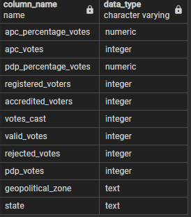

# 2015-2019-Presidential-Election-Analysis-with-SQL
>*A Case Study on APC & PDP party in Nigeria*

## Introduction:

This is a presidential election analysis report that occured in Nigeria between the year 2015 & 2019. In this report, we would be focusing on the top or major parties (APC & PDP) involved in the election and a breakdown of how they got their respective votes across the states and geopolitical zones in the country.
 
 
In this project, would be covering the following;
 
 
* Objectives      [here](https://github.com/Ay43/2015-2019-Nigeria-Presidential-Election/blob/main/README.md#objectives)
* Data Sourcing   [here](https://github.com/Ay43/2015-2019-Nigeria-Presidential-Election/blob/main/README.md#data-sourcing)
* Data Loading And Arrangement    [here](https://github.com/Ay43/2015-2019-Nigeria-Presidential-Election/blob/main/README.md#data-loading-and-arrangement)
* Findings    [here](https://github.com/Ay43/2015-2019-Nigeria-Presidential-Election/blob/main/README.md#findings)
* Conclusion    [here](https://github.com/Ay43/2015-2019-Nigeria-Presidential-Election/blob/main/README.md#conclusions)
* Recommended Solutions   [here](https://github.com/Ay43/2015-2019-Nigeria-Presidential-Election/blob/main/README.md#recommended-solutions)
* Codes   [here](https://github.com/Ay43/2015-2019-Nigeria-Presidential-Election/blob/main/README.md#codes)
* Tools   [here](https://github.com/Ay43/2015-2019-Nigeria-Presidential-Election/blob/main/README.md#tools)
* Credits [here](https://github.com/Ay43/2015-2019-Nigeria-Presidential-Election/blob/main/README.md#credits)
 

## Objectives:

The Objective of this analysis is to help answer some questions mentioned in the **findings** section of this project, which is to help give insight or  overview on how APC and PDP were able to gathered votes across all states and geopolitical zones at the 2015 and 2019 Presidential Election in Nigeria. 

Also, the Findings from this report would provide us with a data driven prediction on what is expected to play out in the 2023 presidential election in the country.

You can skip all other process and jump right in to the **Findings** by clicking  [here](https://github.com/Ay43/2015-2019-Nigeria-Presidential-Election/blob/main/README.md#findings) 
 
 
 
## Data Sourcing:

Data was provided in the raw form and can be found [here](https://www.kaggle.com/datasets/somtoe/nigerian-presidential-election-results?select=2023elections.csv)
 
 
 
## Data Loading And Arrangement:

* The table structure was created before the raw file could be loaded into the database with the below command

>*2015 & 2019 Presidential Election Command*

|        2015     |     2019      |
|:----------------|:--------------:|
   |

* The data was loaded into the database from Server/PostgresSQL14/Databases/postgres/Schemas/Public/Tables/ then the 2 tables created namely election_2015 and election_2019.

* From each of the tables created right-click/Import/filename/locate the file/click the format option/select csv/ go to columns and uncheck other colums that are not present in the file/ then OK. At this point our file has been loaded to the database and it is ready for queries 🙂. However, lets have a look on the table information of the two(2) tables namely election_2015 & elections_2019
 
 
>*Table Information*

The 2 tables (election_2015 and election_2019) consist of Eleven(11) columns each

| election_2015     | election_2019      |
|:----------------  |:--------------:|
   |

The table structure has been created, data  has been loaded, we have an idea of each table informations so *lets dive into the findings*
  
 
 
## Findings:
 
>*How many states and geopolitical_zones contributed to the 2015 and 2019 presidential election?*

In Nigeria, there are **36 states** and **1 Federal Capital Territory** present in the country making the sum total equals **37 states** available on the dataset and 6 geopolitical_zones in the country.

| Command Prompt    | Result     |
|:----------------  |:--------------:|
   |

Let us have a look at how APC & PDP were able to gather votes on the average across the states and geopolitical zones in the country.

 &nbsp; 
>*What is the AVERAGE votes the 2 parties (Apc & Pdp) got in 2015 & 2019*

It was discovered that APC **(2015: *416890*, 2019: *410590*)** average votes were more than PDP **(2015: *347383*, 2019: *304405*)** average votes in 2015 & 2019 respectively. However, APC votes **fell** 🔽 by 6300 votes in 2019 compare to their average votes in 2015 while PDP votes also **fell** 🔽 by 42978 votes in 2019 compare to their average votes in 2015.

| Command Prompt    | Result     |
|:----------------  |:--------------:|
   |

Let us have a look at how the 2 parties were individually affected by the average votes.

 &nbsp;

>*How many states votes were won by APC above its average in 2015 & 2019 **(2015: *416890*, 2019: *410590*)** ?*

It appears that APC had **13** states out of the 37 cumulative number of states that were above the AVERAGE votes they got in 2015 and 2019.

| Command Prompt    | Result     |
|:----------------  |:--------------:|
   |

what of Pdp votes above its average?
 
 &nbsp; 

>*How many state votes were won by PDP above its average in 2015 & 2019 **(2015: *347383*, 2019: *304405*)** ?*

It also appears that PDP had **9** states out of the 37 cumulative number of states votes that were above the AVERAGE votes they got in 2015 and 2019.

| Command Prompt    | Result     |
|:----------------  |:--------------:|
   |

Let us do a COMPARISON between the 2 parties, we would be looking at how many votes by states did one party had above the average votes gotten by the other party in 2015 and 2019.

 &nbsp; 

>*How many states votes WON by APC were ABOVE PDP average **(2015: *347383*, 2019: *304405*)** votes got in 2015 & 2019?*

It was discovered that APC had **18** states out of the 37 cumulative number of states votes that were ABOVE the PDP AVERAGE votes in 2015 and 2019.

| Command Prompt        | Result     |
|:----------------      |:--------------:|
 |

 
 &nbsp; 

>*How many states votes WON by PDP were ABOVE APC average **(2015: *416890*, 2019: *410590*)** votes got in 2015 & 2019?*

It was also discovered that PDP had **6** states out of the 37 cumulative number of states votes that were ABOVE the APC AVERAGE votes in 2015 and 2019.

| Command Prompt        | Result     |
|:----------------      |:--------------:|
 |

At this point, we already have an understanding how the 2 parties were affected by the average votes they got individually and in comparison in 2015 and 2019. *Lets take it further to see the highest vote they got in 2015 & 2019 and how they were affected by it individually and in comparison*.

 &nbsp; 
 
>*What is the HIGHEST votes the 2 parties (Apc & Pdp) got in 2015 & 2019*

In 2015, the HIGHEST votes gotten by the 2 parties (apc & pdp) were 1,903,999 & 1,487,075 respectively while 2019 HIGHEST votes were 1,464,768 & 649,612 respectively. 

However, APC votes **fell** 🔽 by 439,231 in 2019 compare to their highest votes in 2015 while PDP votes also **fell** 🔽 by 837,463 votes in 2019 compare to their highest votes in 2015.

| Command Prompt    | Result     |
|:----------------  |:--------------:|
   |

Let us have a look at a comparison of how many states were WON by APC that were ABOVE pdp Highest votes in 2015 & 2019.

&nbsp; 
 
>*How many states votes were WON by APC above PDP **(2015: *1487075* , 2019: *649612*)** HIGHEST votes in 2015 and 2019*

In **2015**, Kano state was the only state with **1,903,999** votes for apc which were higher than pdp highest votes *1,487,075* in the country that year

| Command Prompt       | Result     |
|:----------------     |:--------------:|
  |

However,

In **2019**, "Kano"
"Katsina"
"Kaduna"
"Borno"
"Bauchi"
"Jigawa" states were the states won by apc above pdp highest votes *649,612* in the country that year

| Command Prompt       | Result     |
|:----------------     |:--------------:|
  |

*Hol up a sec, wouldnt it be nice to know which state delivered more votes for apc that were HIGHER than pdp highest in 2015 and 2019 respectively? Yea, you guessed right.* Kano did 🙂. Let me show you

| Command Prompt        | Result     |
|:----------------      |:--------------:|
 |

 Kano delivered **1,903,999** votes in 2015 for apc (Higher than the most votes 1,487,075 pdp got in the same year) and still delivered **1,464,768** votes in 2019 for apc (Higher than the most votes 649,612 pdp got in the same year).

Okay enough for all the apc wins let us have a look at how pdp got more votes than apc highest in 2015 and 2019.

&nbsp; 
 
>*How many states votes were WON by PDP above APC **(2015: *1903999* , 2019: *1464768*)** HIGHEST votes in 2015 and 2019*

Apparently, there was no states votes by pdp above apc highest in 2015

| Command Prompt       | Result     |
|:----------------     |:--------------:|
  |

Also

Samething happened in 2019. There was no states votes by pdp above apc highest in 2019 as well.

| Command Prompt       | Result     |
|:----------------     |:--------------:|
  |

*if there were no states votes won by pdp above apc highest in the individual years, Of course you can guess there would be nothing when we check for the years combined* 😞

| Command Prompt        | Result     |
|:----------------      |:--------------:|
 |

Okay that is that. Let me now show you the states WON by APC and the percentage difference compare to PDP number of votes from the same states during the 2015 and 2019 Presidential election

&nbsp; 
 
>*How many states were WON by APC against pdp in 2015 & 2019 Presidential Election and in what percentage?*

In **2015**, It was discovered that APC WON **21** states out of the 37 cumulative number of states during the presidential election with the HIGHEST percentage votes gap from BORNO state leading pdp in the state with *90%* votes and the least percentage votes gap was from ONDO state leading pdp with *9%* votes

| Command Prompt        | Result     |
|:----------------      |:--------------:|
   | 

Also, In **2019**, data has shown that APC WON **19** states out of the 37 cumulative number of states during the presidential election with the HIGHEST percentage votes gap from BORNO state again (borno must be very loyal to apc 😆) leading pdp in the state with *84%* votes (that's like 6% fall 🔽 compare to 2015) and the least percentage votes gap were from OSUN & NASSARAWA states leading pdp with *1%* votes each respectively in the state

| Command Prompt        | Result     |
|:----------------      |:--------------:|
   | 

And thats not all, I went further to check for the states WON by APC against pdp in both years and by their percentage (i.e states that apc won in 2015 and still won in 2019). However, It was discovered that **17** states out of the 37 cumulative number of states were WON by APC in 2015 & 2019 presidential election in the country.

| Command Prompt          | Result     |
|:----------------        |:--------------:|
   | 

What does this tell us? Apparently 17 states are loyal to APC in the country 🤔. Let us now have a look at states WON by PDP against apc and at what percentage difference during the 2015 and 2019 Presidential election

&nbsp; 
 
>*How many states were WON by PDP against apc in 2015 & 2019 Presidential Election and in what percentage?*

In **2015**, The data has shown that PDP WON **16** states out of the 37 cumulative number of states during the presidential election leading apc with the HIGHEST percentage votes gap of *97%* from BAYELSA state while FCT (federal capital territory) gave PDP the least percentage votes gap leading apc with *4%* votes 

| Command Prompt        | Result     |
|:----------------      |:--------------:|
   | 

While, In **2019**, PDP WON **18** states out of the 37 cumulative number of states during the presidential election with the HIGHEST percentage votes gap from ANAMBRA state leading apc in the state with *88.1%* votes and the least percentage votes gap were from OYO states leading apc with *0.2%* votes in the state

| Command Prompt        | Result     |
|:----------------      |:--------------:|
   | 

Also, Let us have a look at the states WON by PDP in 2015 and 2019 combined (i.e states won by pdp in 2015 and still won in 2019)

| Command Prompt          | Result     |
|:----------------        |:--------------:|
   | 

Apparently, The total number of states WON by PDP in 2015 and 2019 were **14** states. This could also mean 14 states are loyal to PDP in the country 🤔. Let us have a view on how PDP and APC influenced the votes in the geopolitical zones in the country during the 2015 and 2019 presidential Election.

&nbsp; 
 
>*What is the Total Votes gotten by APC and PDP from the geopolitical zones in the country during the 2015 & 2019 Presidential election?*

Data has Shown that APC **(2015: *15,424,921*, 2019: *15,191,847*)** total votes were more than PDP **(2015: *12,853,162*, 2019: *11,262,978*)** total votes in 2015 & 2019 respectively. However, APC votes **fell** 🔽 in 2019 by 233,074 votes compare to their total votes in 2015 while PDP votes also **fell** 🔽 by 1,590,184 votes in 2019 compare to their total votes in 2015.

| Command Prompt    | Result     |
|:----------------  |:--------------:|
   |

 
Let us have a look at how the 2 parties were voted for by the geopolitical_zones in the country.

&nbsp; 
 
>*How were the 2 parties voted for by the geopolitical zones in the country during the 2015 & 2019 Presidential election?*

It was discovered that NORTHWEST provided Apc with the most votes in 2015 & 2019 with the total votes of 7115199 and 5995651 respectively While SOUTH-SOUTH and NORTHWEST provided Pdp with the most votes in 2015 & 2019 with the total votes of 4714725 and 2280465 respectively/

| Command Prompt    | Result     |
|:----------------  |:--------------:|
   |

Let us have a look at how the APC influenced votes by percentage in the geopolitical zones over Pdp during the 2015 & 2019 Presidential Election.

&nbsp; 
 
>*What is the percentage votes by geopolitical zones WON by APC compare to Pdp in 2015 and 2019 Presidential Election?*

In **2015**, APC WON **4** (Northwest, Northeast, Northcentral, Southwest) geopolitical zones out of the 6 geopolitical zones present in the country during the presidential election with the HIGHEST percentage votes from the NORTH WEST leading pdp with *68%* votes and the least percentage votes was from the SOUTH WEST leading pdp with *14%* votes

| Command Prompt       | Result         |
|:----------------     |:--------------:|
 |

Also In **2019**, APC still WON **4** (Northwest, Northeast, Northcentral, Southwest) geopolitical zones with the HIGHEST percentage votes again from the NORTH WEST leading pdp with *45%* votes this time and the least percentage votes was also from the SOUTH WEST leading pdp with *7%* votes.

| Command Prompt       | Result         |
|:----------------     |:--------------:|
 |

A quick view on how PDP influenced votes by percentage in the geopolitical zones over Apc during the 2015 & 2019 Presidential Election.

&nbsp; 
 
>*What is the percentage votes by geopolitical zones WON by PDP compare to Apc in 2015 and 2019 Presidential Election?*

In **2015**, Data showed that PDP WON **2** (Southeast and Southsouth) geopolitical zones out of the 6 geopolitical zones present in the country with the HIGHEST percentage votes from the SOUTH EAST leading apc with *85%* votes While the least percentage votes was from the SOUTH SOUTH leading apc with *84%* votes. Lets have a look at their influence in 2019

| Command Prompt       | Result         |
|:----------------     |:--------------:|
 |

In **2019**, PDP still WON **2** (Southeast and Southsouth) geopolitical zones with the HIGHEST percentage votes from the SOUTH EAST but this time leading apc with *61%* votes and the least percentage votes was also from the SOUTH EAST leading apc with *36%* votes.

| Command Prompt       | Result         |
|:----------------     |:--------------:|
 |

 
It seems pdp have their foot well grounded in the Southeast and Southsouth respectively. 

Okay let's have a breakdown of how the 2 parties got their votes from the country's geopolitical zone in 2015 & 2019.

&nbsp; 
 
>*How did the 2 parties (Apc & Pdp) influenced votes in the *NORTH-WEST* during the 2015 and 2019 Presidential Election?*

In **2015**, Apc and Pdp got 7,115,199 &	1,339,709 total votes respectively from the NORTH-WEST and 5,995,651 &	2,280,465 total votes respectively in **2019**. There is 1,119,548 fall 🔽 in the total votes gotten by Apc in 2019 compare to 2015 and an increase 🔼 of 940,756 total votes gotten by Pdp in 2019 compare to 2015 from the North-west region.

| Command Prompt       | Result         |
|:----------------     |:--------------:|
        |

However, Lets have a look at how the states in the North-west voted the 2 parties (Apc & Pdp) during the 2015 & 2019 presidential election.

| Command Prompt        | Result         |
|:----------------      |:--------------:|
  |

&nbsp;

>*How did the 2 parties (Apc & Pdp) influence votes in the *SOUTH-WEST* during the 2015 and 2019 Presidential Election?*

In **2015**, The total votes gotten by Apc and Pdp from the South-west were 2,433,193 &	1,821,416 respectively with 2,036,450 &	1,776,670 respectively in **2019**. The data shows that there were total of 396,743 & 44,746 fall 🔽 respectively in the votes gotten by the 2 parties in the region in 2019 compare to 2015.

| Command Prompt       | Result         |
|:----------------     |:--------------:|
        |

However, Lets have a look at how the states in the South-west voted the 2 parties (Apc & Pdp) during the 2015 & 2019 presidential election.

| Command Prompt        | Result         |
|:----------------      |:--------------:|
  |

&nbsp;

>*How did the 2 parties (Apc & Pdp) influenced votes in the *NORTH-CENTRAL* during the 2015 and 2019 Presidential Election?*

In **2015**, North-central contibuted to the presidential election with 2,411,013 &	1,715,818 total votes from Apc and Pdp respectively While in **2019** the 2 parties got 2,465,599	& 2,023,769 total votes respectively from the region which shows there was 54,586 & 307,951 increase 🔼 from the 2 parties respectively in 2019 compare to 2015.

| Command Prompt       | Result         |
|:----------------     |:--------------:|
        |

However, Lets have a look at how the states in the North-central voted the 2 parties (Apc & Pdp) during the 2015 & 2019 presidential election.

| Command Prompt        | Result         |
|:----------------      |:--------------:|
  |

&nbsp;

>*How did the 2 parties (Apc & Pdp) influenced votes in the *SOUTH-SOUTH* during the 2015 and 2019 Presidential Election?*

In **2015**, Apc and Pdp were able to gather the total votes of 418,590	& 4,714,725 respectively and in **2019** they both got 1,051,396	& 2,233,232 total votes respectively which is 632,806 increased 🔼 votes by Apc in 2019 compare to 2015 and a 2,481,493 fall 🔽 in Pdp total votes gotten in 2019 compare to 2015.

| Command Prompt       | Result         |
|:----------------     |:--------------:|
        |

However, Lets have a look at how the states in the South-south voted the 2 parties (Apc & Pdp) during the 2015 & 2019 presidential election.

| Command Prompt        | Result         |
|:----------------      |:--------------:|
  |

&nbsp;

>*How did the 2 parties (Apc & Pdp) influenced votes in the *NORTH-EAST* during the 2015 and 2019 Presidential Election?*

In **2015**, Apc and Pdp got 2,848,678	& 796,588 total votes respectively in the region and got 3,238,783	& 1,255,357 total votes respectively in **2019**. It appears the 2 parties had more votes in 2019 compare to 2015 with 390,105	& 458,769 increased 🔼 in total votes in 2019.

| Command Prompt       | Result         |
|:----------------     |:--------------:|
        |

However, Lets have a look at how the states in the North-east voted the 2 parties (Apc & Pdp) during the 2015 & 2019 presidential election.

| Command Prompt        | Result         |
|:----------------      |:--------------:|
  |

&nbsp;

>*How did the 2 parties (Apc & Pdp) influenced votes in the *SOUTH-EAST* during the 2015 and 2019 Presidential Election?*

In **2015**, It appears Apc had lesser votes in the South-east compare to Pdp with total votes of 198,248	& 2,464,906 respectively. Also, In  **2019** Apc still had lesser votes compare to pdp with 403,968	& 1,693,485 total votes respectively. The total votes received by Apc in the region was increased by 205,720 votes in 2019 while Pdp had a fall 🔽 of 771,421 total votes in 2019.

| Command Prompt       | Result         |
|:----------------     |:--------------:|
        |

However, Lets have a look at how the states in the South-east voted the 2 parties (Apc & Pdp) during the 2015 & 2019 presidential election.

| Command Prompt        | Result         |
|:----------------      |:--------------:|
  |

After carefully analysing the 2015 and 2019 presidential election data, Lets have a look at the conclusions and recommended solutions.

&nbsp;

## Conclusions:

>*Overall Findings shows that;*

* There are 37 states (Including the Federal capital Territory) and 6 geopolitical zones present in the country during the 2015 and 2019 Presidential election.

* On the average, in the respective years 2015 & 2019 APC had more votes than Pdp.

* APC had 13 states votes that were above the AVERAGE votes they got in 2015 & 2019 at 416,890 and 410,590 respectively While PDP had 9 states votes that were above the AVERAGE votes they got in 2015 & 2019 at 347,383 and 304,405 respectively.

* APC had 18 states votes that were above  Pdp AVERAGE votes in 2015 & 2019 at 347,383 and 304,405 respectively While PDP had 6 states votes that were above  Apc AVERAGE votes in 2015 & 2019 at 416,890 and 410,590 respectively.

* APC had the HIGHEST votes altogether in the 2015 & 2019 presidential election.

* In 2015, One(1) state (Kano) votes for APC were above Pdp's HIGHEST votes in that year While Six(6) states("Kano" "Katsina" "Kaduna" "Borno" "Bauchi" "Jigawa") votes for APC were above Pdp's HIGHEST votes in 2019. However, Kano state is the only state with votes above Pdp's HIGHEST votes in 2015 & 2019 altogether.

* PDP had no state votes that were above Apc HIGHEST votes in 2015 & 2019 respectively.

* APC WON 21 and 19 states in 2015 & 2019 respectively. However, 17 states delivered For Apc in 2015 and still delivered in the 2019 presidential election.

* PDP WON 16 and 18 states in 2015 & 2019 respectively. However, 14 states delivered For Pdp in 2015 and still delivered in the 2019 presidential election.

* APC had the MOST votes from the geopolitical zones compare to Pdp in the 2015 and 2019 preseidential election respectively.

* During the 2015 & 2019 Presidential Election, NORTHWEST provided APC with the MOST votes from the geopolitical zones in the country While SOUTH-SOUTH and NORTHWEST provided PDP with the MOST votes in 2015 & 2019 respectively.

* In 2015 and 2019, APC WON from Four(4) geopolitical zones (Northwest, Northeast, Northcentral, Southwest) While PDP WON from Two(2) geopolitical zones (Southeast and Southsouth).

 * In 2015 & 2019, the state with the MOST vote for APC from the NORTH-WEST is KANO While state with the MOST vote for PDP in the same region is KADUNA.

 * 

  

 
## Recommended Solutions

>*For ;*

## Codes

[Click here]([https://drive.google.com/file/d/1Ta9c0XaGWdDUMatOMZsyPz4cMAKqDLS-/view?usp=sharing](https://github.com/Ay43/2015-2019-Nigeria-Presidential-Election/blob/main/presidential%20election%20(2015%20%26%202019).sql))

## Tools

* Postgresql

## Credits

* @Somtoe
* Kaggle 
* Google
* Github

## Contacts and other Projects

[Click here](https://ay43.github.io/)
